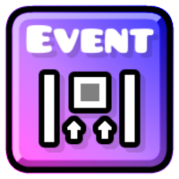

# Trigger <cr>V</c><co>i</c><cy>s</c><cg>u</c><cj>a</c><cl>l</c><cb>i</c><cp>z</c><cr>e</c><co>r</c>

## About
Trigger Visualizer replaces default trigger textures with clearer visuals that **represent trigger behavior directly in the editor**

Many triggers also **display important values** directly on themselves

Some triggers use **dynamic textures**, meaning they update their appearance based on settings, allowing important information to be visible without opening the edit menu

The mod also includes **Old Color trigger sprite support**, improving compatibility with older levels

---

## Features
- **11 triggers with label support**
    - Event, UI, Static Camera
    - Time, Time Event, Time Control
    - Item Comp, Item Edit, Item Pers
    - Song, Song Edit
- **25 triggers with dynamic textures**
    - Item triggers, Collision, Spawn, Event
    - Move, Rotate, Color, Pulse, Gravity, StartPos
    - Area triggers, Camera triggers, UI, SFX

---

## Notes
- Affects **editor visuals only**
- Does **not** change gameplay